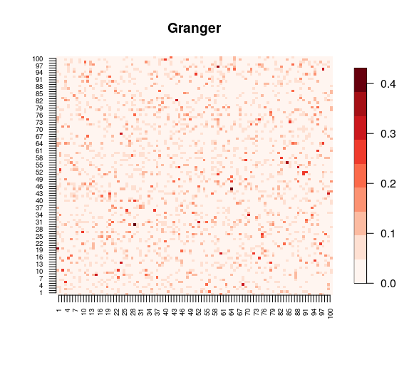
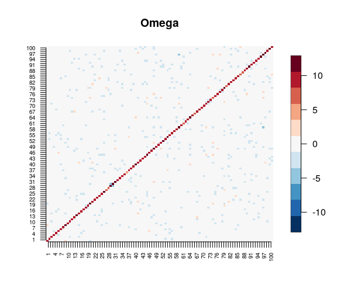
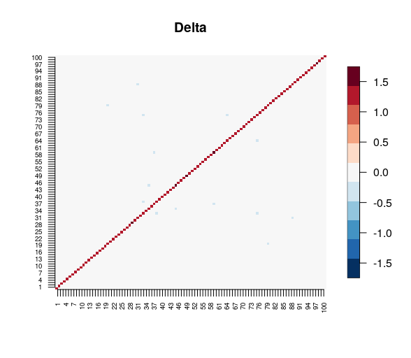

# fnets

Contains methods for factor-adjusted network estimation and forecasting for high-dimensional time series. See 

> _fnets_: Factor-adjusted network estimation and forecasting for high-dimensional time series

by Matteo Barigozzi, Haeran Cho and Dom Owens [arXiv:](insert arXiv link) for full details.


## Installation

To install `fnets` from GitHub:

```
devtools::install_github("https://github.com/Dom-Owens-UoB/fnets")
```

## Usage

We can generate an example dataset used in the above paper for simulation studies, by separately generating the factor-driven common component and the idiosyncratic VAR process as
```
set.seed(222)
n <- 200
p <- 100
common <- sim.factor.M1(n, p)
idio <- sim.idio(n, p)
x <- common$data + idio$data
```

Fit the factor-adjusted VAR model with `q = 2` factors and `lasso` for VAR transition matrix estimation
```
model <- fnets(x, q = 2, idio.method = "lasso")
```
Plot the Granger network induced by the estimated VAR transition matrices:
```
plot(model, type = "heatmap")
```


Estimate and plot the long-run partial correlation network:
```
net <- param.lrpc(model, x)
plot(net, type = "heatmap")
```




Perform h-step ahead forecast 
```
pr <- predict(model, x, h = 1, common.method = "static")
pr$forecast
```


